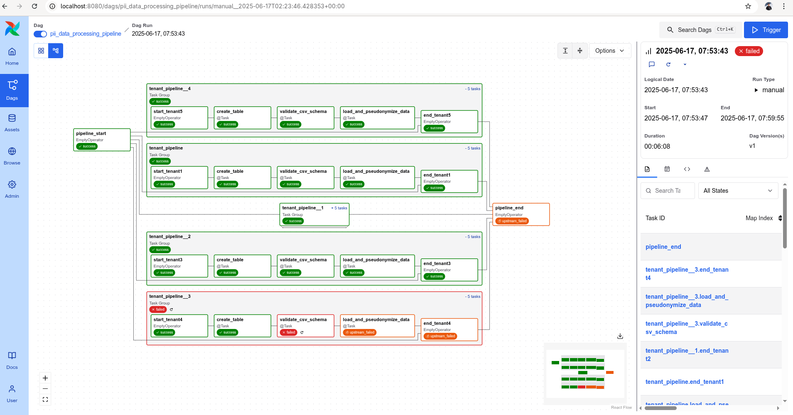

# PII Data Processing Pipeline with Airflow

## Overview

This project implements a robust data processing pipeline using [Apache Airflow](https://airflow.apache.org/) to ingest, validate, pseudonymize, and store CSV data for multiple tenants. The pipeline ensures Personally Identifiable Information (PII) protection by pseudonymizing sensitive fields before loading them into a SQLite database. This setup is ideal for organizations managing multi-tenant data environments and needing strong data privacy controls.

## DAG Pipeline in Graphical View

## Important Note

**Error Handling:** This pipeline demonstrates robust error handling by design. A schema validation error has been intentionally introduced in one tenant's CSV file to showcase how the pipeline handles failures gracefully. When a tenant's data fails validation, only that specific tenant's pipeline will fail, while other tenants continue processing normally. This ensures fault isolation and prevents one tenant's data issues from affecting the entire system.




---

## Key Features

- **Multi-Tenant Support:** Processes data for multiple tenants in parallel.
- **Schema Validation:** Ensures incoming CSV files conform to a strict schema.
- **PII Protection:** Pseudonymizes sensitive user information using a salted hash.
- **Automated Table Management:** Creates and manages separate tables for each tenant.
- **Daily Scheduling:** Runs automatically every day, with retry logic for reliability.
- **Modular Tasks:** Uses Airflow’s `@task` and `@task_group` decorators for clear, maintainable code.

---

## Pipeline Architecture

For each tenant, the following steps are executed in sequence:

1. **Create Table:** Drops and recreates the tenant's table in SQLite.
2. **Validate CSV Schema:** Checks that the CSV file matches the required schema.
3. **Load & Pseudonymize Data:** Reads the CSV, pseudonymizes the `user_id`, and loads data into the database.

```
/usr/local/airflow/
├── dags/
│ └── pii_data_processing_pipeline.py # This DAG file
├── data/
│ ├── sqlite.db # SQLite database
│ └── raw_data/
│ ├── tenant1.csv
│ ├── tenant2.csv
│ └── ... (one CSV per tenant)
└── utils/
└── helper_functions.py # Contains hash_value, anonymize_data
```

---

## CSV Schema Requirements

Each tenant's CSV file **must** have the following columns in this order:

- `id` (INTEGER)
- `user_id` (TEXT) - **PII field, will be pseudonymized**
- `event_time` (TEXT)
- `value` (REAL)
- `country` (TEXT)

**Example:**

```csv
id,user_id,event_time,value,country
1,johndoe,2025-06-01T10:00:00,123.45,USA
2,janedoe,2025-06-01T11:00:00,234.56,CAN
```

---

## PII Protection

- The `user_id` column is pseudonymized using a salted hash (`hash_value(x, salt='shuru')`).
- No raw PII is stored in the database.

---

## How the DAG Works

1. **Scheduled Execution:** Runs daily, starting from 2025-06-16.
2. **Retries:** Each task will retry up to 3 times with a 2-minute delay if it fails.
3. **Parallel Processing:** All tenants are processed in parallel for efficiency.
4. **Task Groups:** Each tenant's workflow is encapsulated in a `@task_group` for clarity.
5. **Start/End Markers:** Uses `EmptyOperator` to clearly mark the pipeline's boundaries.

---

## How to Use

1. **Place CSV Files:** Put each tenant's CSV file in `/usr/local/airflow/data/raw_data/` with the filename matching the tenant name (e.g., `tenant1.csv`).
2. **Configure Database:** Ensure the SQLite database path is correct (`/usr/local/airflow/data/sqlite.db`).
3. **Helper Functions:** Implement `hash_value` and `anonymize_data` in `utils/helper_functions.py`.
4. **Deploy DAG:** Place the DAG file in your Airflow `dags/` directory.
5. **Start Airflow:** Launch the Airflow scheduler and webserver to begin processing.

---

## Customization

- **Tenants:** Edit the `tenants` list to add or remove tenants.
- **Schema:** Update the `validation_list` and table schema if your data structure changes.
- **Database:** Switch to another database (e.g., PostgreSQL) by updating the connection logic.

---

## Troubleshooting

- **Schema Mismatch:** If a CSV file does not match the required schema, the pipeline will fail and log an error.
- **Missing Files:** If a tenant's CSV file is missing, the corresponding pipeline will fail for that tenant only.
- **Database Errors:** Ensure the database file is writable and accessible by Airflow.

---

## Extending the Pipeline

- **Add KPI Calculation:** Insert additional tasks to compute and store KPIs after loading data.
- **Data Quality Checks:** Add more validation tasks as needed.
- **Notification:** Integrate with email or Slack for failure alerts.

---


